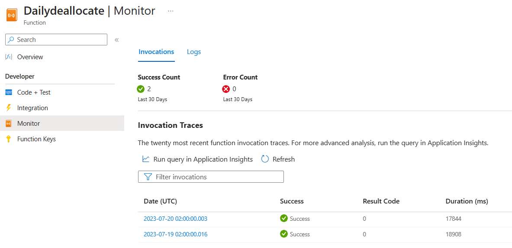
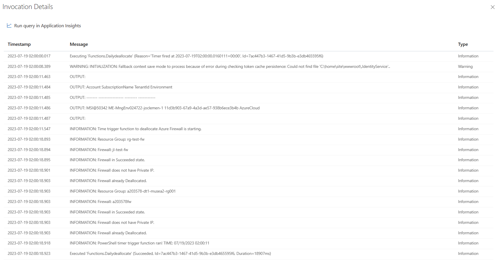
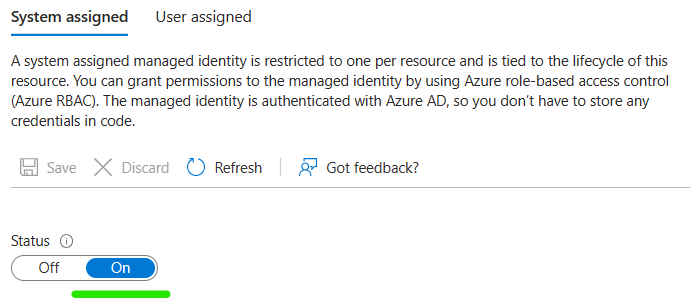

# azfwfunctions

An Azure Function resource with HTTP triggered or TIMER triggered Powershell code to provide status and control for allocating or deallocating Azure Firewalls.

## Overview

This folder contains the Azure Functions that are used to manage firewalls.  Each function searches the Subscription for all Azure Firewalls.  The resource is named "azfwfunctions" for this document.  The function app has a Managed Identity that has Contributor rights to the Subscription.  

## Deployment

Instructions on deploying an Azure Function from VSCode is available in Microsoft learning [here.](https://learn.microsoft.com/en-us/azure/azure-functions/functions-develop-vs-code?tabs=powershell)

## Using the Functions

The functions are triggered by HTTP requests or by timer.  The functions are secured by a default function key.  The functions are written in Powershell.

Functions reside in an Azure Function resource (azfwfunctions).  

There are two API functions defined:

- Dailydeallocate
- fw

The fw API function has four functions defined:

- Allocate
- Deallocate
- Status
- Toggle

### Daily Deallocate

This is a Timer function set to 02:00 UTC (9:00pm CDT) that will deallocate the firewalls found.  Timer configuration is found in the [function.json](Dailydeallocate/function.json) file in the Dailydeallocate folder.

Run information can be found in the Azure portal under the Function App, Functions, Dailydeallocate, Monitor page.



Then click on one of the log dates.



### fw API mapped functions

The fw API function is mapped to the four functions and called using the {funcName} in the API call.

The fw API function also has a parameter for the {fwName}.  This is used to limit the function to a single firewall.  If the fwName is not matched, processing is halted.  If the fwName = "all", all firewalls in the subscription are processed.

Function API URL:

```text
https://azfwfunctions.azurewebsites.net/api/fw/{funcName}/{fwName}?code={default function key}
```


### Allocate

This function sets the firewalls found to allocated.

Function API URL:

```text
https://azfwfunctions.azurewebsites.net/api/fw/allocate/{fwName}?code={default function key}
```

Typical API response:

```text
This HTTP triggered Azure function is beginning processing.

Resource Group: rg-test-fw
Firewall: jl-test-fw
  Firewall in Succeeded state.
    Firewall does not have Private IP.  Allocating FW.
        VNet: jl-test-vnet
        ip: jl-test-fw-pip
        manip: jl-test-fw-mgmt-pip
  Schedule change to Firewall.
    Firewall change scheduled.

Resource Group: a203578-dt1-musea2-rg001
Firewall: a203578fw
  Firewall in Succeeded state.
    Firewall does not have Private IP.  Allocating FW.
        VNet: a203578-dt1-musea2-vnet001
        ip: a203578fw-pip
        manip: a203578fw-mgmt-pip
  Schedule change to Firewall.
    Firewall change scheduled.

Scheduled Job Status
Long Running Operation for 'Set-AzFirewall' Running
Long Running Operation for 'Set-AzFirewall' Running

Use azfwfunctions/status API to check firewall state(s) in 3-10 minutes.
```

### Deallocate

This function sets the firewalls found to deallocated.

Function API URL:

```text
https://azfwfunctions.azurewebsites.net/api/fw/deallocate/{fwName}?code={default function key}
```

Typical API response:

```text
This HTTP triggered Azure function is beginning processing.

Resource Group: rg-test-fw
Firewall: jl-test-fw
  Firewall in Succeeded state.
    Firewall has Private IP.  Deallocating FW.
  Schedule change to Firewall.
    Firewall change scheduled.

Resource Group: a203578-dt1-musea2-rg001
Firewall: a203578fw
  Firewall in Succeeded state.
    Firewall has Private IP.  Deallocating FW.
  Schedule change to Firewall.
    Firewall change scheduled.

Scheduled Job Status
Long Running Operation for 'Set-AzFirewall' Running
Long Running Operation for 'Set-AzFirewall' Running

Use azfwfunctions/status API to check firewall state(s) in 3-10 minutes.
```

### Status

This function returns the status of the firewalls found.

Function API URL:

```text
https://azfwfunctions.azurewebsites.net/api/fw/status/{fwName}?code={default function key}
```

Typical API response:

```text
This HTTP triggered Azure function is beginning processing.

Resource Group: rg-test-fw
Firewall: jl-test-fw
  Firewall not in Succeeded state.
    State: Updating

Resource Group: a203578-dt1-musea2-rg001
Firewall: a203578fw
  Firewall not in Succeeded state.
    State: Updating

Scheduled Job Status
Long Running Operation for 'Set-AzFirewall' Running
Long Running Operation for 'Set-AzFirewall' Running
```

or another API response:

```text
This HTTP triggered Azure function is beginning processing.

Resource Group: rg-test-fw
Firewall: jl-test-fw
  Firewall in Succeeded state.
    Firewall does not have Private IP.  Firewall is Deallocated.

Resource Group: a203578-dt1-musea2-rg001
Firewall: a203578fw
  Firewall in Succeeded state.
    Firewall does not have Private IP.  Firewall is Deallocated.

Scheduled Job Status
Long Running Operation for 'Set-AzFirewall' Completed
Long Running Operation for 'Set-AzFirewall' Completed
```

### Toggle

This function toggles the allocation state of the the firewalls found.

Function API URL:

```text
https://azfwfunctions.azurewebsites.net/api/fw/toggle/{fwName}?code={default function key}
```

Typical API response:

```text
This HTTP triggered Azure function is beginning processing.

Resource Group: rg-test-fw
Firewall: jl-test-fw
  Firewall in Succeeded state.
    Firewall does not have Private IP.  Allocating FW.
        VNet: jl-test-vnet
        ip: jl-test-fw-pip
        manip: jl-test-fw-mgmt-pip
  Schedule change to Firewall.
    Firewall update scheduled in background.

Resource Group: a203578-dt1-musea2-rg001
Firewall: a203578fw
  Firewall in Succeeded state.
    Firewall does not have Private IP.  Allocating FW.
        VNet: a203578-dt1-musea2-vnet001
        ip: a203578fw-pip
        manip: a203578fw-mgmt-pip
  Schedule change to Firewall.
    Firewall update scheduled in background.

Scheduled Job Status
Long Running Operation for 'Set-AzFirewall' Running
Long Running Operation for 'Set-AzFirewall' Running

Use azfwfunctions/status API to check firewall state(s) in 3-10 minutes.
```

## Function App Configuration

The function app has a Managed Identity enabled that has Contributor rights to the Subscription.  The Managed Identity is used to authenticate to Azure.




Additional files are used to configure the function app.

### host.json

The host.json file is used to configure the function app compute and presentation.  The host.json file is found in the root of the function app.

### local.settings.json

The local.settings.json file is used to configure the function app.  The local.settings.json file is found in the root of the function app.

### profile.ps1

The profile.ps1 file is used to configure the function app at startup.  The profile.ps1 file is found in the root of the function app.

### requirements.psd1

The requirements.psd1 file is used to configure the function app compute.  The requirements.psd1 file is found in the root of the function app.
